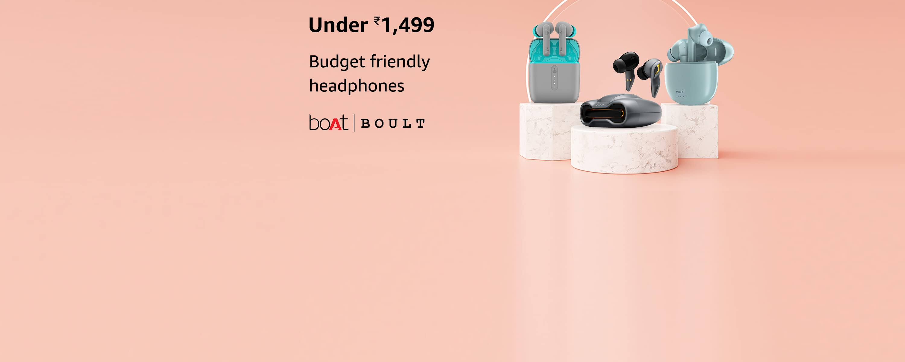

# 🛒 Amazon Clone

A simple and responsive front-end **Amazon homepage clone** built using **HTML and CSS**.  
This was created as a practice project while learning web development.

---

## 📸 Preview

 <!-- Replace with actual preview image if needed -->

---

## 🛠️ Features

- ✅ Header with logo, search bar, and user menu
- ✅ Product categories and banners
- ✅ Grid layout for products
- ✅ Responsive design using CSS Flexbox/Grid

---

## 🚀 Technologies Used

- HTML5  
- CSS3  
- Flexbox & Grid

---

## 📁 Folder Structure

---

## 🙋‍♀️ Created By

**Khushi Roy**  
[GitHub](https://github.com/Khushi-Roy-123)

---

